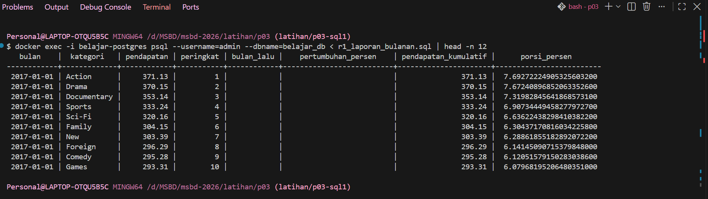

# Laporan Latihan 3 - Pertemuan 3

## Nama Anggota dan Kontribusi

| Anggota | Kontribusi Commit |
|---|---|
| **Viter Moldy Kesuma** | `docs:` menambahkan readme pertemuan 3 dan Reflektif A  `feat:` add q01-q05 |
| **Gideon Finsus Siburian** | `feat:` menambahkan q10-q15   `docs:` menambahkan Reflektif C |
| **Nadine Tantiara Hutagaol** | `feat:` menambahkan q19-q20 dan `r1_laporan_bulanan.sql`   `docs:` menambahkan Reflektif E dan bukti r1_10_baris.png |
| **Rizky Cristian Fero Sihombing** | `feat:` menambahkan q06-q09   `docs:` menambahkan Reflektif B |
| **Siti Naifah Batubara** | `feat:` menambahkan q16-q18   `docs:` menambahkan Reflektif D dan bukti |

## Pertanyaan Reflektif A - Subquery

**1. Pada Q4, apa tepatnya yang membuat NOT IN berbahaya, dan bagaimana memeriksa apakah sebuah kolom rawan terhadap masalah itu?**

> `NOT IN` itu bisa jadi masalah kalau hasil dari subquery ternyata ada nilai `NULL`. Karena saat ada `NULL`, perbandingannya jadi `UNKNOWN`, jadi hasil NOT IN bisa saja tidak menampilkan data yang seharusnya ada.
>
> Kalau di Q4, sebenarnya aman karena `inventory.film_id` memang tidak boleh bernilai `NULL`. Jadi hasil `NOT IN` dan `NOT EXISTS` tetap sama, yaitu 42 baris. Kalau mau memastikan suatu kolom aman, bisa dicek dulu menggunakan `\d nama_tabel` untuk melihat apakah kolomnya `NOT NULL`, atau cek datanya langsung dengan `IS NULL`. Menurut kami, `NOT EXISTS` lebih aman untuk digunakan karena tidak terpengaruh oleh masalah `NULL` seperti pada `NOT IN`.

**2. Pada Q5, berapa kali subquery dievaluasi secara konseptual, dan mengapa “sekali per baris luar” belum tentu sama dengan yang benar-benar dikerjakan mesin?**

> Pada Q5, secara konsep subquery berkorelasi ini dievaluasi untuk setiap baris dari query luar karena nilai `store_id`-nya mengikuti toko yang sedang diperiksa. Jadi secara konseptual bisa dianggap subquery dijalankan berulang untuk setiap baris luar.
>
> Tapi itu belum tentu sama dengan yang benar-benar dilakukan oleh PostgreSQL. Mesin database bisa melakukan optimasi terhadap query, misalnya mengubah cara eksekusi atau menyimpan hasil tertentu supaya tidak perlu menghitung ulang semuanya. Jadi “sekali per baris luar” lebih menggambarkan logika query, bukan berarti mesin pasti benar-benar mengeksekusi subquery sebanyak itu.
>
> Pada Q5, hasil akhirnya adalah 500 baris karena query mengambil film dengan rental_rate tertinggi untuk masing-masing toko.

## Pertanyaan Reflektif B - CTE dan Recursive CTE

**1. Pada Q7, mengapa recursive term hanya melihat baris yang baru dihasilkan pada iterasi sebelumnya, dan apa akibatnya jika ia melihat seluruh hasil?**

> Pada Q7, recursive term hanya melihat baris yang baru dihasilkan pada iterasi sebelumnya supaya prosesnya berjalan bertahap dari atasan ke bawahan. Jadi setelah menemukan pegawai puncak, query mencari bawahannya, lalu dari bawahan tersebut mencari bawahannya lagi, begitu seterusnya sampai tidak ada bawahan lagi.
>
> Kalau recursive term melihat seluruh hasil yang sudah ada dari semua iterasi, prosesnya bisa menjadi tidak terarah karena baris dari level sebelumnya dan level-level yang lebih awal ikut diproses kembali. Hal ini bisa menyebabkan data diproses berulang dan membuat hasil menjadi tidak sesuai dengan struktur hierarki yang seharusnya.

**2. Kapan mengganti `UNION ALL` dengan `UNION` dapat menghentikan siklus, dan mengapa itu tetap bukan solusi yang baik?**

> Mengganti `UNION ALL` dengan `UNION` dapat membantu menghentikan siklus ketika baris yang dihasilkan pada proses rekursif ternyata sama persis dengan baris yang sudah pernah dihasilkan sebelumnya. `UNION` akan menghapus baris yang duplikat, sehingga baris tersebut tidak terus ditambahkan ke hasil recursive CTE. Dengan begitu, ketika tidak ada baris baru yang bisa ditambahkan, proses rekursif bisa berhenti.
>
> Tapi, penggunaan `UNION` tetap bukan solusi yang baik untuk menangani siklus. Alasannya, `UNION` hanya mengecek apakah seluruh barisnya sama atau tidak. Kalau ada bagian data yang berbeda, misalnya nilai `level` atau `jalur` terus berubah, maka baris tersebut tetap dianggap sebagai data baru dan proses bisa terus berjalan. Selain itu, menggunakan `UNION` juga bisa membuat proses lebih berat karena database harus melakukan pengecekan dan penghapusan duplikat. Jadi, lebih baik siklus ditangani langsung dari logika recursive CTE, misalnya dengan menyimpan dan mengecek data yang sudah pernah dilewati.

## Pertanyaan Reflektif C - Window Function

**1. Pada Q14, berapa tanggal yang berbeda, dan sifat data apa pada tabel payment yang menyebabkan perbedaan?**

> Dari hasil Q14, terdapat 25 tanggal yang menghasilkan nilai rata-rata berbeda dari total 32 tanggal transaksi yang ada di Pagila. Perbedaan ini terjadi karena cara kerja `RANGE` dan `ROWS` dalam menentukan data yang masuk ke perhitungan rata-rata tidak sama.
>
> Pada query ini, `RANGE BETWEEN 6 PRECEDING AND CURRENT ROW` melihat berdasarkan nilai tanggal, sedangkan `ROWS BETWEEN 6 PRECEDING AND CURRENT ROW` melihat 7 baris terakhir secara fisik. Karena data transaksi memiliki tanggal yang tidak selalu berurutan atau memiliki jarak antar tanggal, jumlah data yang dihitung oleh kedua frame tersebut bisa berbeda.
>
> Jadi, perbedaan nilai `avg_range` dan `avg_rows` dipengaruhi oleh pola dan urutan tanggal pada data transaksi. Setelah beberapa baris, terutama ketika terdapat tanggal yang tidak berurutan, hasil dari kedua metode mulai menunjukkan perbedaan.

**2. Jika Q13 menjadi laporan resmi keuangan, versi mana yang benar dan mengapa kesalahan frame sulit ditemukan melalui pengujian biasa?**

> Untuk laporan keuangan resmi, sebaiknya menggunakan frame yang ditulis secara jelas, yaitu `ROWS BETWEEN 6 PRECEDING AND CURRENT ROW` seperti pada Q13. Dengan begitu, rata-rata yang dihitung memang berdasarkan 7 baris terakhir, sesuai dengan kebutuhan rata-rata 7 hari.
>
> Kesalahan dalam penggunaan frame cukup sulit ditemukan karena query yang salah belum tentu menghasilkan error. SQL-nya tetap bisa dijalankan dan angka yang keluar juga terlihat normal. Selain itu, pada data awal hasilnya bisa terlihat mirip dengan perhitungan yang benar karena jumlah baris yang dihitung masih sedikit. Perbedaannya baru lebih terlihat ketika data sudah bertambah banyak. Karena itu, untuk laporan resmi sebaiknya frame ditulis secara eksplisit agar hasil perhitungan tidak bergantung pada aturan default dan mengurangi risiko kesalahan.

**3. Pada Q15, apa yang terjadi pada total belanja jika ORDER BY ditambahkan ke dalam OVER tanpa menuliskan frame?**

> Jika `ORDER BY p.payment_date` ditambahkan ke dalam `OVER (PARTITION BY p.customer_id)` pada bagian `total_belanja_pelanggan`, maka cara perhitungan `SUM(amount)` akan berubah. Sebelumnya, tanpa `ORDER BY`, `SUM(amount) OVER (PARTITION BY customer_id)` menghitung seluruh total transaksi yang dimiliki setiap pelanggan, sehingga totalnya akan sama pada setiap baris pelanggan tersebut.

> Setelah ditambahkan `ORDER BY payment_date`, PostgreSQL akan menggunakan frame default yang berjalan dari awal data sampai baris yang sedang diproses. Akibatnya, `nilai total_belanja_pelanggan` tidak lagi langsung menunjukkan seluruh total belanja pelanggan, tetapi menjadi running total, yaitu jumlah belanja yang terus bertambah mengikuti urutan transaksi berdasarkan tanggal.
>
> Jadi, pada transaksi pertama nilainya hanya berasal dari transaksi tersebut, kemudian pada transaksi berikutnya nilai sebelumnya akan ditambah dengan jumlah transaksi yang baru. Hal ini membuat nilai pada kolom tersebut bisa berbeda di setiap baris pelanggan. Karena itu, kalau tujuan Q15 adalah menampilkan total seluruh belanja pelanggan pada setiap transaksinya, maka ORDER BY memang tidak perlu ditambahkan pada bagian `SUM(amount) OVER (PARTITION BY customer_id)`.

## Pertanyaan Reflektif D - Agregasi Lanjutan dan Operasi Himpunan

**1. Pada Q16, tanpa `GROUPING()`, bagaimana pembaca membedakan subtotal dari baris data yang kolomnya memang kosong?**

> Q16: Tanpa menggunakan GROUPING() , baris subtotal yang dihasilkan oleh ROLLUP akan ditampilkan sebagai NULL. Hal ini dapat menyebabkan kebingungan karena sulit membedakan NULL yang merupakan subtotal atau grand total dengan NULL yang memang berasal dari data. Fungsi GROUPING() digunakan untuk membedakan keduanya, karena akan menghasilkan nilai 1 pada baris hasil agregasi ROLLUP. Nilai tersebut kemudian dapat ditampilkan sebagai teks seperti SEMUA agar hasilnya lebih mudah dipahami.

**2. Pada Q17, mengapa versi `FILTER` dan `CASE WHEN` dapat memberi rata-rata berbeda walaupun jumlah baris sama?**

> Q17: Q17 : FILTER (WHERE length > 90) dan CASE WHEN length > 90 THEN length END menghasilkan nilai rata-rata yang sama karena AVG() secara otomatis mengabaikan nilai NULL. Perbedaan akan terjadi jika CASE WHEN menggunakan ELSE 0. Dengan adanya ELSE 0, data dengan durasi ≤ 90 akan dianggap sebagai nilai 0 dan ikut dihitung dalam rata-rata. Akibatnya, nilai rata-rata yang dihasilkan menjadi lebih kecil.

## Pertanyaan Reflektif E - JSONB

**1. Dari nomor transaksi, status, jumlah, dan identitas pelanggan di dalam payload, mana yang sebaiknya dipromosikan menjadi kolom relasional dengan constraint dan mana yang tepat tetap berada di JSON? Berikan alasan untuk setiap pilihan.**

> Menurut kelompok kami, nomor transaksi, status, jumlah, dan identitas pelanggan sebaiknya dipromosikan jadi kolom relasional. Data tersebut merupakan informasi utama untuk mencari, memfilter, mengurutkan, dan melakukan perhitungan. Jadi jika dijadikan kolom, kita bisa memberikan constraint seperti `NOT NULL`, `UNIQUE`, atau tipe data tertentu lainnya jadi datanya lebih teratur dan konsisten.
>
> Sedangkan buat data yang lebih fleksibel, seperti kontak pelanggan, lebih cocok tetap di `JSON`. Karena satu pelanggan bisa memiliki beberapa kontak dengan jenis yang berbeda, misalnya WhatsApp dan email, juga jumlah kontaknya ga selalu sama. Kalau dibuat menjadi banyak kolom, strukturnya malah bisa menjadi kurang fleksibel. Jadi, menurut kelompok kami data yang penting dan sering dipakai dalam proses database bagusnya dijadikan kolom relasional, sedangkan data yang sifatnya fleksibel dan tidak selalu memiliki struktur yang sama bisa tetap disimpan dalam `JSON`.

## Temuan Q14

> Pada Q14 dilakukan perbandingan antara window frame `RANGE` dan `ROWS` untuk menghitung rata-rata omzet harian.
>
>`RANGE BETWEEN 6 PRECEDING AND CURRENT ROW` menghitung berdasarkan rentang nilai pada kolom `tanggal`, sedangkan `ROWS BETWEEN 6 PRECEDING AND CURRENT ROW` menghitung berdasarkan 7 baris fisik terakhir.
>
>Perbedaan hasil dapat terjadi ketika terdapat tanggal yang tidak berurutan atau terdapat nilai tanggal yang sama. Dari percobaan ini dapat dilihat bahwa pemilihan `RANGE` atau `ROWS` perlu disesuaikan dengan kebutuhan analisis data.

## Hasil R1

> R1 berhasil menghasilkan laporan pendapatan bulanan berdasarkan kategori. Hasilnya menampilkan bulan, nama kategori, total pendapatan, peringkat kategori, pendapatan bulan sebelumnya, persentase pertumbuhan, pendapatan kumulatif, dan proporsi pendapatan kategori terhadap total pendapatan.

## Tautan Merge Request

> `PULL REQUEST` https://github.com/vitermoldy/msbd-2026/pull/1